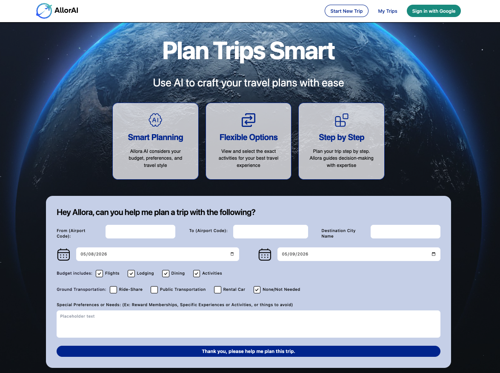

# Allorai
<a id="readme-top"></a>
<!-- PROJECT LOGO -->
<br />
<div align="center">
  <a href="https://allorai.app">
    
  </a>

  <h3 align="center">Allorai</h3>

  <p align="center">
    A conversational, AI-powered travel-planning app — chat your way from "where should I go?" to a saved itinerary.
    <br />
    Live demo: <a href="https://allorai.app">allorai.app</a>
  </p>

  <br />

  <a href="https://allorai.app">
    
  </a>
</div>


<!-- TABLE OF CONTENTS -->
<details>
  <summary>Table of Contents</summary>
  <ol>
    <li>
      <a href="#about-the-project">About The Project</a>
      <ul>
        <li><a href="#built-with">Built With</a></li>
        <li><a href="#architecture">Architecture</a></li>
      </ul>
    </li>
    <li>
      <a href="#getting-started">Getting Started</a>
      <ul>
        <li><a href="#prerequisites">Prerequisites</a></li>
        <li><a href="#installation">Installation</a></li>
      </ul>
    </li>
    <li><a href="#usage">Usage</a></li>
    <li><a href="#roadmap">Roadmap</a></li>
    <li><a href="#license">License</a></li>
    <li><a href="#team">Team</a></li>
    <li><a href="#acknowledgments">Acknowledgments</a></li>
  </ol>
</details>


<!-- ABOUT THE PROJECT -->
## About The Project

Allorai was built for the **Let's Get Technical Hackathon 2026**, organized by [Shashi Lo](https://www.linkedin.com/in/shashilo/). The brief required a travel-planning app that:

- ships **at least three micro-frontends** deployed to **Zephyr Cloud**
- generates a **trip itinerary** for the traveler
- recommends the **best selfie spot** at the destination

We took the brief literally and built a chat-driven planner that walks a traveler from a destination prompt all the way to a saved itinerary, with photo-worthy spots, restaurants, hotels, and flight options curated along the way. Trips are persisted per user (anonymous by default, optional Google upgrade) and can be revisited from the *My Trips* page.

<p align="right">(<a href="#readme-top">back to top</a>)</p>

### Built With

[![React][React.com]][React-url]
[![TypeScript][TypeScript.com]][TypeScript-url]
[![Nx][Nx.com]][Nx-url]
[![Module Federation][ModuleFederation.com]][ModuleFederation-url]
[![Rspack][Rspack.com]][Rspack-url]
[![Tailwind CSS][TailwindCSS.com]][Tailwind-url]
[![Zephyr Cloud][Zephyr.com]][Zephyr-url]
[![Express][Express.com]][Express-url]
[![Zod][Zod.com]][Zod-url]
[![Supabase][Supabase.com]][Supabase-url]
[![Railway][Railway.com]][Railway-url]
[![LangGraph][LangGraph.com]][LangGraph-url]
[![Anthropic][Anthropic.com]][Anthropic-url]
[![Amadeus][Amadeus.com]][Amadeus-url]

<p align="right">(<a href="#readme-top">back to top</a>)</p>

### Architecture

- **Frontend** — Module Federation host (`apps/web/platform`) loading remotes for `chat`, `itineraries`, `landing`, and `explore`. All five apps deploy to Zephyr Cloud and federate at runtime.
- **API Gateway** (`apps/api-gateway`) — a thin Express service deployed to Railway. Validates incoming requests, enforces per-IP rate limits, and proxies chat/tips traffic to the agents API with an internal API key.
- **Agents API** — a separate Python service in [tonyb650/allorai-agents-api](https://github.com/tonyb650/allorai-agents-api). Handles intent classification, multi-tool orchestration (flights, hotels, activities, selfie spots, eateries), and integrates with the Amadeus API for live flight/hotel data.
- **Database & Auth** — Supabase Postgres + Auth + Storage. Anonymous sign-in on first visit (no login UI), optional Google upgrade via `linkIdentity`. Saved trips and pinned activities live behind RLS keyed on `auth.uid()`.
- **Image hosting** — a public Supabase Storage bucket serves a curated set of activity, eatery, nature, and selfie-spot photos used as sample/seed data.

<p align="right">(<a href="#readme-top">back to top</a>)</p>


<!-- GETTING STARTED -->
## Getting Started

The repo is an Nx + pnpm monorepo. To get a local copy running, follow these steps.

### Prerequisites

- Node `>=20 <21` (see `engines` in root `package.json`)
- pnpm 10.x
  ```sh
  corepack use pnpm@10
  ```
- A Supabase project with the migrations under `supabase/migrations/` applied (creates `trips` and `trip_activities` with RLS policies).
- The agents API running locally — see [tonyb650/allorai-agents-api](https://github.com/tonyb650/allorai-agents-api) for setup. The gateway expects it at `AGENTS_URL` (default `http://localhost:8000`).

### Installation

1. Clone the repo
   ```sh
   git clone https://github.com/tonyb650/allorai-zc.git
   cd allorai-zc
   ```
2. Install dependencies
   ```sh
   pnpm install
   ```
3. Set up environment variables. Each app has its own `.env.example` — copy each to `.env` and fill in values:
   - `apps/api-gateway/.env` — `AGENTS_URL`, `INTERNAL_API_KEY`, `CORS_ORIGIN`, `PORT`
   - `apps/web/chat/.env` — `NX_PUBLIC_API_BASE_URL`, `NX_PUBLIC_SUPABASE_URL`, `NX_PUBLIC_SUPABASE_ANON_KEY`
   - `apps/web/platform/.env` and `apps/web/itineraries/.env` — the Supabase URL/anon-key pair
4. Start the agents API (in its own terminal — see its repo for instructions).
5. Start the API gateway:
   ```sh
   pnpm nx serve api-gateway
   ```
6. Start the web shell (loads chat, itineraries, etc. via Module Federation):
   ```sh
   pnpm nx serve platform
   ```
7. Open [http://localhost:4200](http://localhost:4200).

<p align="right">(<a href="#readme-top">back to top</a>)</p>


<!-- USAGE -->
## Usage

![Allorai landing screenshot][landing-screenshot]

From the landing page, a traveler describes their trip in natural language. Allorai's agents extract the destination, dates, and preferences, then walk through a guided sequence: outbound and return flights → hotel → restaurants → selfie spots → activities → final itinerary. Pinned items become a saved trip in *My Trips*, accessible from the navbar.

<p align="right">(<a href="#readme-top">back to top</a>)</p>


<!-- ROADMAP -->
## Roadmap

This is the original hackathon submission. Active development paused after the event, but the live demo at [allorai.app](https://allorai.app) remains running. Possible future work, time permitting:

- Persist conversation history (currently held only in frontend state by design — sessions are ephemeral)
- Per-environment runtime config via Zephyr's `ZE_PUBLIC_*` mechanism (instead of build-time `NX_PUBLIC_*`)
- Enrich live agent responses with image URLs (currently returned as empty strings)
- Replace ad-hoc rate limiting with proper per-user JWT-verified rate limits

<p align="right">(<a href="#readme-top">back to top</a>)</p>


<!-- LICENSE -->
## License

Distributed under the Unlicense License. See `LICENSE.txt` for more information.

<p align="right">(<a href="#readme-top">back to top</a>)</p>


<!-- TEAM -->
## Team

| Name | LinkedIn |
| --- | --- |
| Bradley Diep | [linkedin.com/in/bradley-diep-2170451b2](https://www.linkedin.com/in/bradley-diep-2170451b2/) |
| Hector Suazo | [linkedin.com/in/hector-suazo](https://www.linkedin.com/in/hector-suazo/) |
| Jeremy Fischer | [linkedin.com/in/jeremy-ev-fischer](https://www.linkedin.com/in/jeremy-ev-fischer) |
| Monica Shin | [linkedin.com/in/monicashin](https://www.linkedin.com/in/monicashin/) |
| Anthony Brierly | [linkedin.com/in/tony-brierly](https://www.linkedin.com/in/tony-brierly/) |

<p align="right">(<a href="#readme-top">back to top</a>)</p>


<!-- ACKNOWLEDGMENTS -->
## Acknowledgments

* [Let's Get Technical Hackathon 2026](https://www.linkedin.com/in/shashilo/) — thanks to **Shashi Lo** for organizing the event and shaping the brief.
* [Zephyr Cloud](https://zephyr-cloud.io) for the micro-frontend deployment platform that the brief was built around.
* [Supabase](https://supabase.com) for Postgres, Auth, and Storage.
* [Anthropic](https://www.anthropic.com/) (Claude) for the LLM powering the agent reasoning.
* [Amadeus for Developers](https://developers.amadeus.com) for flight and hotel data.
* [Railway](https://railway.app) for hosting the API gateway and agents API.
* [Lucide](https://lucide.dev) and [React Icons](https://react-icons.github.io/react-icons/search) for iconography.
* [Best README Template](https://github.com/othneildrew/Best-README-Template).
* [Img Shields](https://shields.io).

<p align="right">(<a href="#readme-top">back to top</a>)</p>


<!-- MARKDOWN LINKS & IMAGES -->
<!-- https://www.markdownguide.org/basic-syntax/#reference-style-links -->

[landing-screenshot]: ./allorai_landing_screenshot.png

[React.com]: https://img.shields.io/badge/React-20232a?style=for-the-badge&logo=react&logoColor=61dafb
[React-url]: https://react.dev/

[TypeScript.com]: https://img.shields.io/badge/TypeScript-3178c6?style=for-the-badge&logo=typescript&logoColor=white
[TypeScript-url]: https://www.typescriptlang.org/

[Nx.com]: https://img.shields.io/badge/Nx-143055?style=for-the-badge&logo=nx&logoColor=white
[Nx-url]: https://nx.dev/

[ModuleFederation.com]: https://img.shields.io/badge/Module%20Federation-0f1015?style=for-the-badge&logo=webpack&logoColor=8dd6f9
[ModuleFederation-url]: https://module-federation.io/

[Rspack.com]: https://img.shields.io/badge/Rspack-f93920?style=for-the-badge&logo=rspack&logoColor=white
[Rspack-url]: https://rspack.dev/

[TailwindCSS.com]: https://img.shields.io/badge/Tailwind%20CSS-041f30?style=for-the-badge&logo=tailwindcss&logoColor=00bcff
[Tailwind-url]: https://tailwindcss.com/

[Zephyr.com]: https://img.shields.io/badge/Zephyr%20Cloud-7e22ce?style=for-the-badge&logoColor=white
[Zephyr-url]: https://zephyr-cloud.io/

[Express.com]: https://img.shields.io/badge/Express-000000?style=for-the-badge&logo=express&logoColor=white
[Express-url]: https://expressjs.com/

[Zod.com]: https://img.shields.io/badge/Zod-3068b7?style=for-the-badge&logo=zod&logoColor=white
[Zod-url]: https://zod.dev/

[Supabase.com]: https://img.shields.io/badge/Supabase-3ecf8e?style=for-the-badge&logo=supabase&logoColor=white
[Supabase-url]: https://supabase.com/

[Railway.com]: https://img.shields.io/badge/Railway-0b0d0e?style=for-the-badge&logo=railway&logoColor=white
[Railway-url]: https://railway.app/

[LangGraph.com]: https://img.shields.io/badge/LangGraph-1c3c3c?style=for-the-badge&logo=langgraph&logoColor=white
[LangGraph-url]: https://langchain-ai.github.io/langgraph/

[Anthropic.com]: https://img.shields.io/badge/Anthropic-cc785c?style=for-the-badge&logo=anthropic&logoColor=white
[Anthropic-url]: https://www.anthropic.com/

[Amadeus.com]: https://img.shields.io/badge/Amadeus%20API-005eb8?style=for-the-badge&logoColor=white
[Amadeus-url]: https://developers.amadeus.com/
